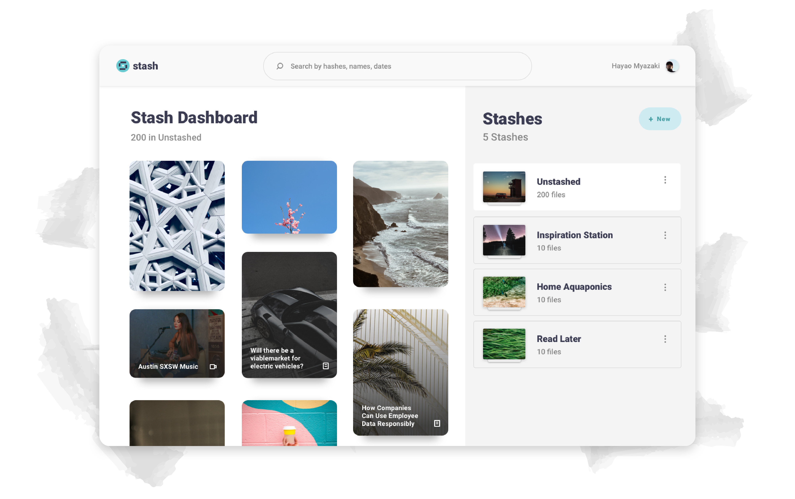

# IPFS Stash

User friendly Chrome extension + "Stashboard" to manage your IPFS assets.

*Note*: this is hackathon code. It is not safe to use, and probably harmful to look at.

*Designed and built by [Two's Complement](http://www.twoscomplement.io)*

# Installing

* Install (and run) [Siderus Orion](https://orion.siderus.io/)
* Install Node, NPM
* Install webpack-cli `npm install webpack-cli -g`
* Build popup: `cd popup` `npm install` `npm run build`
* Build dashboard: `cd dashboard` `npm install` `npm run build`
* Build content scripts: `cd content` `npm install` `webpack`
* Install extension (`chrome://extensions` enable developer mode `load unpacked` select extension directory

# Usage

* Load webpage
* Hover over image
* Click "Stash" button
* Open extension and visit dashboard to manage files
* Organize files into "Stashes" (IPFS MFS directories)

# Feature TODO

* Support for video, text, and full webpages
* Support for direct file uploads
* Autopin on add
* Manage pinning/unpinning
* De-douplication helpers for MFS
* Intelligent searching and indexing
* Naming Stashes
* Sorting
* Sharing
* Multi-node and multi-device syncing
* Content script popup for adding multiple items
* Simplify IPFS node download and/or instructions for Orion
* Publish extension to Chrome store
* Remote node option
* Advanced mode with all the normal IPFS options

# Code TODO

* Separate container / UI components
* Simplify popup app to static non-React app
* Clean up background script
* Structure multi-file (separated) content script(s)
* Audit libraries/package sizes across extension parts
* Configurable IPFS options
